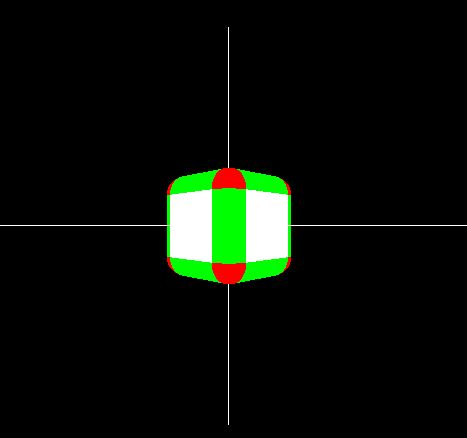
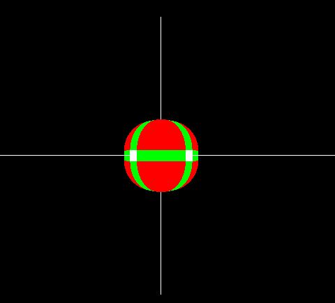
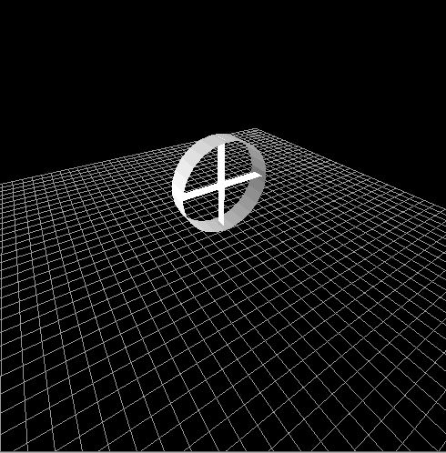
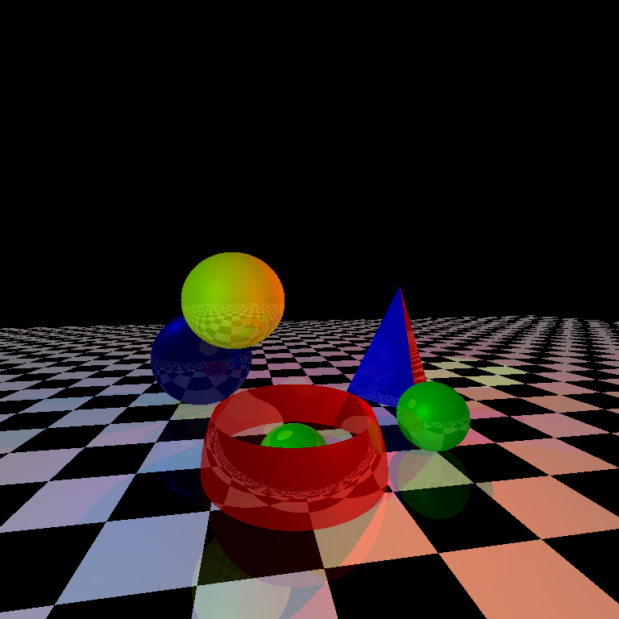
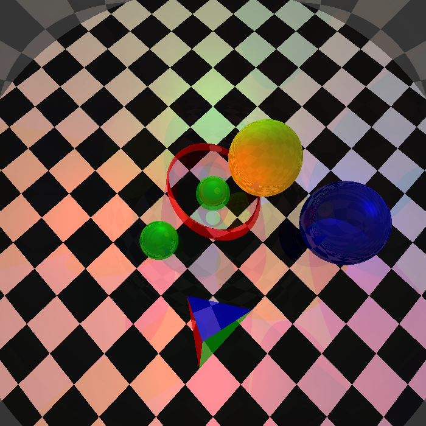

# computer-graphics-sessional
This repository contains all the assignments from CSE410 course.

## assignment-on-opengl

[Find details of the assignment here](assignment-on-opengl\spec.pdf)

  
   
  <em>Fig 1 : Task 1</em>

  
   
  <em>Fig 2 : Task 1</em>

  
   
  <em>Fig 3 : Task 3</em>

## assignment-on-raster-based-graphics-pipeline
[Find details of the assignment here](assignment-on-raster-based-graphics-pipeline\Offline-2-Specifications-Complete.pdf)

  
   
  <em>Fig 4 : Output for a specific input</em>

  
   
  <em>Fig 5 : Output for a specific input</em>

## assignment-on-ray-tracing

[Find details of the assignment here](assignment-on-ray-tracing\spec.pdf)

  
   
  <em>Fig 4 : Output</em>

  
   
  <em>Fig 5 : Output</em>

